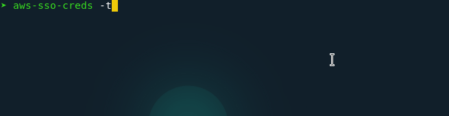

# aws-sso-creds

<div id="top"></div>
<!-- PROJECT LOGO -->
<br />
<div align="center">

  
  

  <h3 align="center">AWS SSO Creds</h3>
</div>


<!-- TABLE OF CONTENTS -->
<details>
  <summary>Table of Contents</summary>
  <ol>
    <li>
      <a href="#about">About The Project</a>
      <ul>
        <li><a href="#built-with">Built With</a></li>
      </ul>
    </li>
    <li>
      <a href="#installation">Instalation</a>
      <ul>
        <li><a href="#static-releases">Static</a></li>
        <li><a href="#from-source">From source</a></li>
      </ul>
    </li>
    <li><a href="#usage">Usage</a></li>
    <li><a href="#contributing">Contributing</a></li>
    <li><a href="#license">License</a></li>
    <li><a href="#contact">Contact</a></li>
    <li><a href="#acknowledgments">Acknowledgments</a></li>
  </ol>
</details>


## About

Opinionated CLI app for AWS SSO made in Golang!

AWS SSO Creds is an AWS SSO creds manager for the shell.

Use it to **easily** manage entries in `~/.aws/config` & `~/.aws/credentials` files, so you can focus on your AWS workflows, without the hazzle of manually managing your credentials.


### Built With

This section should list any major frameworks/libraries used to bootstrap your project. Leave any add-ons/plugins for the acknowledgements section. Here are a few examples.

* [Bubbletea](https://github.com/charmbracelet/bubbletea)
* [Go-fuzzyfinder](https://github.com/ktr0731/go-fuzzyfinder)


<!-- GETTING STARTED -->
## Installation

### Static Releases
Download the binary based on your OS in [The releases section](https://github.com/JorgeReus/aws-sso-creds/releases)
### From source
#### Prerequisites
- Go 1.17+


Run `go install github.com/JorgeReus/aws-sso-creds/cmd/aws-sso-creds@latest`


<!-- USAGE EXAMPLES -->
## Usage
```
Usage: aws-sso-creds [-fhpst] [-r value] [-u value] [parameters ...]
 -f, --forceAuth    Force Authentication with AWS SSO
 -h, --help         Help
 -p, --populateRoles
                    Populate AWS SSO roles in ~/.aws/config
 -r, --SSORegion=value
                    The AWS SSO region, the AWS_SSO_REGION env var has
                    precedence over this flag
 -s, --selectFuzzy  Select your role/credentials in a fuzzy-finder previewer
 -t, --temp         Create temporary credentials in ~/.aws/credentials
 -u, --SSOUrl=value
                    The SSO URL(https://<my-domain>.awsapps.com/start) the
                    AWS_SSO_START_URL env var has precedence over this flag
```

Set your env variables `(AWS_SSO_START_URL & AWS_SSO_REGION)` and run `aws-sso-creds -t`


<!-- CONTRIBUTING -->
## Contributing

Contributions are what make the open source community such an amazing place to learn, inspire, and create. Any contributions you make are **greatly appreciated**.

If you have a suggestion that would make this better, please fork the repo and create a pull request. You can also simply open an issue with the tag "enhancement".
Don't forget to give the project a star! Thanks again!

1. Fork the Project
2. Create your Feature Branch (`git checkout -b feature/AmazingFeature`)
3. Commit your Changes (`git commit -m 'Add some AmazingFeature'`)
4. Push to the Branch (`git push origin feature/AmazingFeature`)
5. Open a Pull Request


<!-- LICENSE -->
## License

Distributed under the MIT License. See `LICENSE` for more information.

<!-- CONTACT -->
## Contact

Jorge Reus - [LinkedIn](www.linkedin.com/in/JorgeGReus)

<!-- ACKNOWLEDGMENTS -->
## Acknowledgments

* [TLDR Legal](https://tldrlegal.com/)
* [Build your own Gopher](https://quasilyte.dev/)
* [Bubbles components](https://github.com/charmbracelet/bubbles)
* [Python implementation of this tool](https://github.com/benkehoe/aws-sso-util)
* [Best README Template](https://github.com/othneildrew/Best-README-Template)
