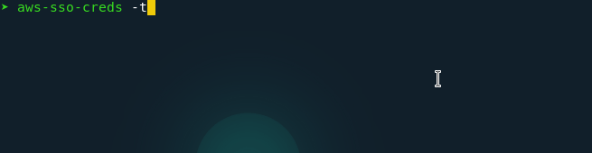

# aws-sso-creds

<div align="center">
  
  <br>
  
  <br>
  

  <h3 align="center">AWS SSO Creds</h3>
</div>

`aws-sso-creds` is a terminal UI for AWS IAM Identity Center (formerly AWS SSO). It helps you manage generated AWS profiles, browse them quickly, and open the AWS console from your active profile without manually editing `~/.aws/config` and `~/.aws/credentials`.

## Quick Start

1. Install the CLI.
2. Create your config interactively:

```bash
aws-sso-creds init
```

3. Generate profiles for one configured organization:

```bash
aws-sso-creds my-org --populateRoles
```

4. Pick a profile from the fuzzy finder:

```bash
aws-sso-creds select
```

5. Export the selected profile:

```bash
export AWS_PROFILE=my-org-admin
```

6. Open the AWS console for the active profile:

```bash
aws-sso-creds open
```

## What It Does

- Creates and maintains an `aws-sso-creds.toml` config file.
- Populates AWS profiles in `~/.aws/config`.
- Creates temporary credentials in `~/.aws/credentials` when requested.
- Lets you browse generated profiles in a fuzzy finder.
- Opens the AWS console using the profile in `AWS_PROFILE`.

## Installation

### Static Releases

Download a binary for your platform from the [GitHub releases page](https://github.com/JorgeReus/aws-sso-creds/releases).

### Install With Go

Prerequisite: Go 1.17+

Release PRs keep this version updated automatically:

<!-- x-release-please-start-version -->
```bash
go install github.com/JorgeReus/aws-sso-creds@1.3.5
```
<!-- x-release-please-end -->

### Build From Source

```bash
git clone https://github.com/JorgeReus/aws-sso-creds.git
cd aws-sso-creds
go build ./...
```

### With Nix

Install from this repo:

```bash
nix profile install github:JorgeReus/aws-sso-creds
```

Run without installing permanently:

```bash
nix run github:JorgeReus/aws-sso-creds
```

Use it as a flake input:

```nix
{
  inputs = {
    aws-sso-creds.url = "github:JorgeReus/aws-sso-creds";
  };
}
```

Then expose the package from your outputs:

```nix
{
  outputs = { self, nixpkgs, aws-sso-creds, ... }:
    let
      system = "aarch64-darwin";
    in
    {
      packages.${system}.default = aws-sso-creds.packages.${system}.default;
    };
}
```

## Configuration

By default, `aws-sso-creds` reads `~/.config/aws-sso-creds.toml`.

Example:

```toml
error_color = "#fa0718"
information_color = "#05fa5f"
warning_color = "#f29830"
focus_color = "#4287f5"
spinner_color = "#42f551"

[organizations.org1]
url = "https://org1.awsapps.com/start"
prefix = "org1"
sso_region = "us-east-1"
default_region = "us-west-2"

[organizations.org2]
url = "https://org2.awsapps.com/start"
prefix = "org2"
sso_region = "us-west-2"
```

Required fields per organization:

- `url`: AWS start URL for the IAM Identity Center organization
- `prefix`: Prefix used for generated AWS profiles
- `sso_region`: Region for the IAM Identity Center organization

Optional fields:

- `default_region`: Default AWS region written to generated profiles
- `region`: Legacy fallback. If `sso_region` is missing, `region` is used as the SSO region

Create or update the config interactively:

```bash
aws-sso-creds init
```

`init` prompts for:

- organization name
- AWS start URL
- prefix
- SSO region
- default AWS region, optional

## Task-Based Usage

### Set Up A New Organization

```bash
aws-sso-creds init
```

This writes or updates `~/.config/aws-sso-creds.toml`.

### Generate Profiles For An Organization

```bash
aws-sso-creds my-org --populateRoles
```

This loads the configured organization, authenticates if needed, and writes AWS SSO profiles to `~/.aws/config`.

### Create Temporary Credentials

```bash
aws-sso-creds my-org --temp
```

Use this when you want temporary credentials written to `~/.aws/credentials`.

### Force A Fresh Login

```bash
aws-sso-creds my-org --forceAuth
```

Use this when cached authentication is stale or you want to re-authenticate explicitly.

### Avoid Opening The Browser Automatically

```bash
aws-sso-creds my-org --noBrowser
```

Use this when you want to complete the flow without auto-launching a browser window.

### Browse Generated Profiles

```bash
aws-sso-creds select
```

This opens a fuzzy finder previewer for entries in your AWS config and credentials files, then prints the selected profile name to stdout.

### Open The AWS Console For The Active Profile

```bash
export AWS_PROFILE=my-org-admin
aws-sso-creds open
```

`open` requires `AWS_PROFILE` to be set to a profile previously generated by this CLI.

## Command Reference

Root command:

```text
aws-sso-creds [flags] [organization]
```

Subcommands:

- `init`: create or update the config interactively
- `select`: choose a profile from the fuzzy finder
- `open`: open the AWS web console for `AWS_PROFILE`
- `completion`: generate shell completions

Root flags:

- `-c, --config`: path to the TOML config file
- `-f, --forceAuth`: force authentication with AWS SSO
- `-b, --noBrowser`: do not open the browser automatically
- `-p, --populateRoles`: populate AWS SSO roles in `~/.aws/config`
- `-t, --temp`: create temporary credentials in `~/.aws/credentials`

Run `aws-sso-creds --help` or `aws-sso-creds [command] --help` for the full CLI help text.

When you run `aws-sso-creds --help` or `aws-sso-creds help`, the root help output also shows the build version. Local builds without release metadata show `Version: dirty`; release binaries show the release tag.

## Contributing

Pull requests are welcome.

1. Fork the repository.
2. Create a feature branch.
3. Commit using Conventional Commits.
4. Push the branch.
5. Open a pull request.

## Releases

- Pull requests run GitHub Actions CI with `go test ./...`.
- Pull request commits must follow Conventional Commits so semantic versioning can be derived automatically.
- Pushes to `main` do not publish a release directly.
- Pushes to `main` run `release-please`, which opens or updates a release PR and creates the next `X.Y.Z` tag when that PR is merged.
- Semver tags matching `X.Y.Z` run GoReleaser and publish GitHub release artifacts.
- Configure a `RELEASE_PLEASE_TOKEN` repository secret backed by a PAT or GitHub App token. The default `GITHUB_TOKEN` does not trigger the tag-based release workflow when `release-please` creates the tag.

## License

Distributed under the MIT License. See [LICENSE](./LICENSE) for details.

## Contact

Jorge Reus - [LinkedIn](https://www.linkedin.com/in/jorgegreus)

## Acknowledgments

- [TLDR Legal](https://tldrlegal.com/)
- [Build your own Gopher](https://quasilyte.dev/)
- [Bubbles components](https://github.com/charmbracelet/bubbles)
- [Python implementation of this tool](https://github.com/benkehoe/aws-sso-util)
- [Best README Template](https://github.com/othneildrew/Best-README-Template)
